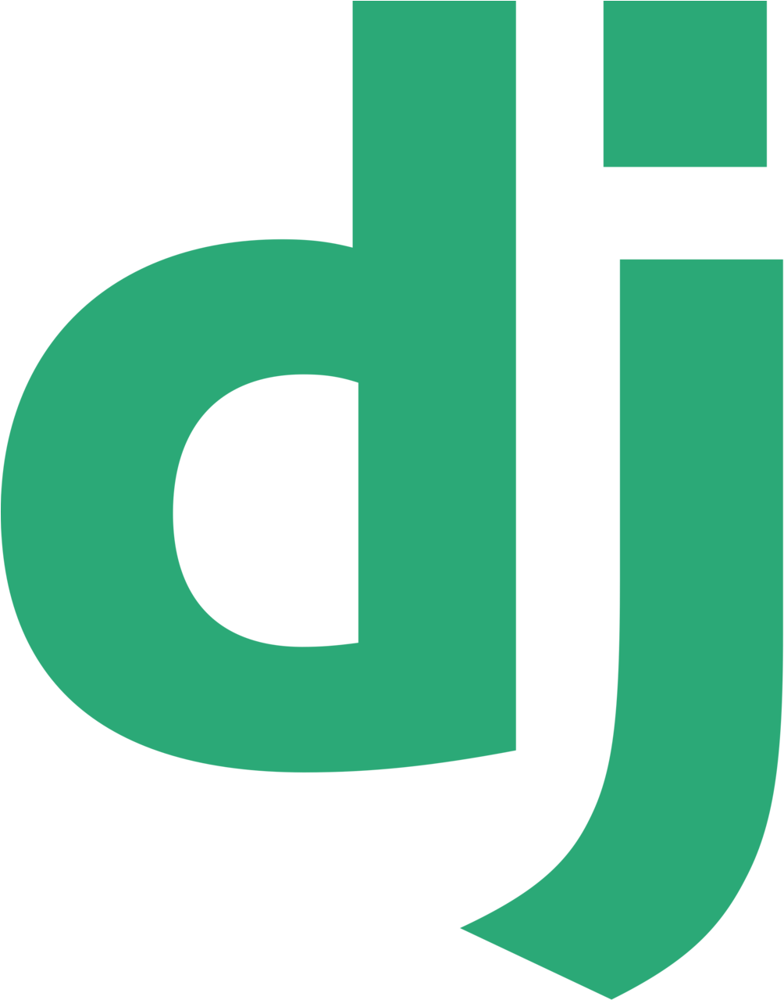

# Hi, I'm Alejandro Hernandez 
  

 
<h3 align="center">Contact me</h3>

<h3 class="title" align="center">About me</h3>
I'm a software engineer who designs, builds, and maintains robust software systems, focused on delivering efficient, high-quality solutions that help companies grow through best practices and modern technologies.
  
<h3 class="title" align="center">What I care about</h3>

I focus on building reliable, maintainable software with clean architecture and strong engineering principles. I enjoy working on scalable solutions, solving complex problems, and continuously improving code quality and performance.

I’m especially interested in backend systems, APIs, and distributed architectures, with a strong emphasis on maintainability, performance, and long-term scalability.

I value clear communication, well-documented code, and solid testing practices—essential for building high-quality software in remote, distributed teams.

I’m looking for projects with real purpose, where technology creates meaningful impact and helps improve people's lives.

<h3 class="title" align="center">What I bring to a team</h3>
• Strong focus on clean architecture, maintainable code, and scalable systems

• Experience working independently and taking ownership of complex features

• Clear written communication and documentation in remote environments

• A mindset of continuous improvement and long-term product quality

<h3 class="title" align="left">Technologies I use</h3>

<!---
alehdzdev/alehdzdev is a ✨ special ✨ repository because its `README.md` (this file) appears on your GitHub profile.
You can click the Preview link to take a look at your changes.
--->
